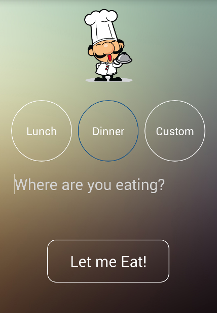

EatNow
======

Android App that helps you decide what you should eat for the next meal based on results from Yelp's API.

- Determines your location automatically
- Gives suggestions based on high Yelp Reviews
- Randomizes results so you don't always see the same suggestions
- Routes you restaurant once you've selected a place
- Option of viewing full Yelp page of restaurants

Future add-ons:
- Remembers what you've selected before and add an option of "Try something new"
- Add option for showing restaurants with Discount deals

Google Play Store: https://play.google.com/store/apps/details?id=com.caren.eatnow

